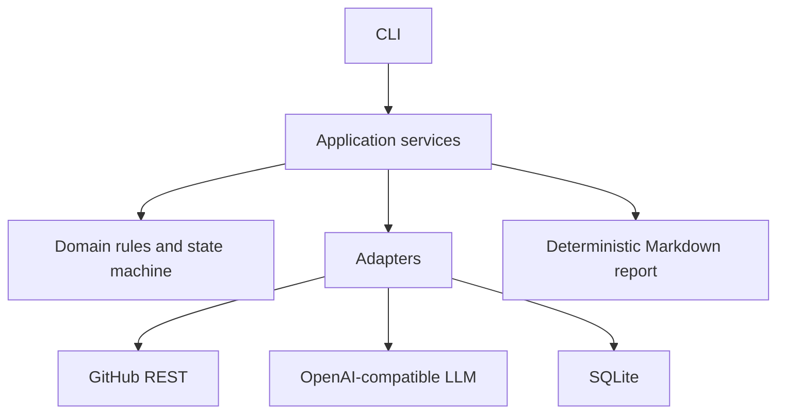

# Repo Detective

Repo Detective is an evidence-grounded AI agent that investigates public GitHub repositories as open-source supply-chain decisions. It chooses its own next step, follows leads, records every action and finding, and returns one of three verdicts:

- `adopt`
- `adopt_with_conditions`
- `reject`

The implementation is intentionally small and auditable: Python 3.12 standard library, SQLite, GitHub REST, and an OpenAI-compatible Chat Completions endpoint. There is no agent framework and no hidden checklist.

## Five-minute start

Requirements: Docker and Docker Compose.

```bash
cp .env.example .env
```

Set at least:

```env
OPENAI_API_KEY=your-key
OPENAI_MODEL=your-model
```

`OPENAI_BASE_URL` defaults to `https://api.openai.com/v1`. Point it at another OpenAI-compatible provider without changing code. `GITHUB_TOKEN` is optional; public repositories work without one.

`docker compose up` builds the image and prints the CLI usage; the two entry points are the commands below.

Investigate a repository (the first run builds the image):

```bash
docker compose run --build --rm app investigate https://github.com/expressjs/express
```

Start the grounded chat over the latest investigation:

```bash
docker compose run --rm app chat latest
```

The named Docker volume preserves investigations between commands.

## Assignment test cases

```bash
docker compose run --rm app investigate expressjs/express
docker compose run --rm app investigate request/request
docker compose run --rm app investigate RIAEvangelist/node-ipc
```

Observed on 2026-08-27 with `openai/gpt-5.6-sol` through OpenRouter (`OPENAI_BASE_URL=https://openrouter.ai/api/v1`), no prompt tuning:

| Repository | Verdict | Calls | Decisive lead the agent followed |
|---|---|---:|---|
| expressjs/express | adopt_with_conditions (high) | 10 | PR title mentioning a body-parser CVE → read `package.json@v5.2.1` → advisory lookup → `compare_refs` → confirmed fix only on master |
| request/request | reject (high) | 2 | README deprecation notice; advisories deliberately left as unverified |
| RIAEvangelist/node-ipc | reject (high) | 7 | Reviewed advisories documenting maintainer-introduced malicious code (10.1.1–10.1.2) |

Chat re-task on request/request (`now check the biggest fork and whether the community moved there`) resumed with 13 calls, identified `postmanlabs/postman-request`, read the full 106-comment alternatives issue, and kept `reject` with the migration question answered. Total cost for all runs was about US$1.

List saved investigations:

```bash
docker compose run --rm app list
```

Print the latest Markdown report:

```bash
docker compose run --rm app report latest --stdout
```

## Human-in-the-loop budget

Each investigation starts with 30 outbound LLM calls. GitHub API calls and grounded chat calls are tracked separately. Before an investigation LLM request is sent, its call is atomically reserved in SQLite.

When one call remains, the agent is only offered two actions:

- `submit_verdict`
- `request_more_budget`

It cannot spend call 30 starting research that would require call 31 to interpret.

If more research is requested:

```bash
docker compose run --rm app approve <investigation-id> --calls 8
```

Or in interactive chat:

```text
/approve 8
```

To decline extra calls and keep the provisional verdict:

```bash
docker compose run --rm app finalize <investigation-id>
```

If the LLM provider itself fails (network error, HTTP 5xx, timeout), the investigation is saved as `paused_external` with the failed attempt counted. Continue it with its remaining budget once the provider is back:

```bash
docker compose run --rm app resume <investigation-id>
```

## Provider notes

- **OpenAI / Anthropic / most gateways:** set `OPENAI_BASE_URL`, `OPENAI_API_KEY`, `OPENAI_MODEL`.
- **Azure OpenAI:** use the v1 endpoint, e.g. `OPENAI_BASE_URL=https://<resource>.openai.azure.com/openai/v1` with `OPENAI_MODEL=<deployment-name>`; it accepts the standard `Authorization: Bearer` header.
- **Local models (Ollama, LM Studio, vLLM):** from inside Docker the host is reachable as `host.docker.internal`, e.g. `OPENAI_BASE_URL=http://host.docker.internal:11434/v1`.
- The request sets `tool_choice: "required"` so the model must answer with a function call. If a provider rejects that value with HTTP 400, the client downgrades to `"auto"` for the rest of the run and says so on stderr. Set `OPENAI_TOOL_CHOICE=auto` to skip the probe. With `auto`, a prose-only reply is logged as an invalid step and costs one budgeted call.
- Slow or reasoning models: raise `LLM_TIMEOUT_SECONDS` (default 120). GitHub calls use the separate `HTTP_TIMEOUT_SECONDS`.

## Chat behavior

The chat has only two model-visible actions:

- `answer_from_log`: answer using stored verdict, log, and evidence IDs. It has no GitHub tools.
- `resume_investigation`: append a user re-task, increment the investigation revision, and resume the original agent with its remaining budget.

A request such as `now check the biggest fork` resumes research and may produce a new verdict and report revision. A question such as `why did you flag the maintainer situation?` is answered only from the stored investigation. The last ten chat messages are included so follow-up questions keep their context. If a re-task arrives after the budget is spent, the instruction is stored as a new revision and the agent pauses for `/approve N`; the approved run then starts from that instruction.

## Architecture



The important boundary is that the agent never receives arbitrary HTTP or database access. It sees a bounded registry of read-only GitHub tools. Tool outputs are normalized for the context window while raw public API responses remain stored as evidence.

### Investigation flow

1. **Intake, no LLM:** parse and constrain the repository input; fetch repository metadata, latest release, and top contributors.
2. **Adaptive agent:** on every turn, choose one tool based on existing evidence IDs or finish/request budget.
3. **Evidence persistence:** save raw response, normalized facts, verification status, source URL, and rate-limit state.
4. **Verdict validation:** reject claims that cite unknown evidence IDs or violate verdict invariants.
5. **Plain-code rendering:** produce a Markdown report from SQLite without an LLM call.
6. **Grounded chat:** answer from the log or re-task the same investigation.

## GitHub tools

The agent can selectively use:

- repository metadata, repository files, and directory listings (so manifests are located, not guessed)
- commits, commit details, and ref comparison
- contributors
- issues and issue comments
- pull requests
- releases and tags
- forks
- repository security advisories
- GitHub's global advisory database, including an explicit malware query

Every research action includes:

- `rationale`
- `question_to_answer`
- `based_on_evidence_ids`

That creates a causal log: what the agent found, which evidence changed its direction, and what it checked next.

## Failure behavior

Expected external failures become evidence states instead of crashes:

- `not_found`
- `unavailable`
- `rate_limited`
- `partial`
- `verified`

For example, an unavailable advisory endpoint cannot be interpreted as “no vulnerabilities.” Renamed repositories follow GitHub redirects and the canonical name is saved. Empty repositories, missing releases/files, archived repositories, malformed model actions, and provider errors all produce explicit status/log entries.

## Local development

No third-party Python packages are required. Python 3.12 is required (`datetime.UTC`, `StrEnum`); if your local interpreter is older, run the suite in the same base image Docker uses:

```bash
export PYTHONPATH=src
python -m unittest discover -s tests -v
python -m repo_detective --help

# or, without a local 3.12:
docker run --rm -v "$PWD:/app" -w /app -e PYTHONPATH=/app/src python:3.12-slim \
  python -m unittest discover -s tests -v
```

### Offline end-to-end smoke test

`tests/fake_openai_server.py` is a scripted OpenAI-compatible provider: it reads the same JSON context the real model receives, follows a fixed tool plan, and submits an evidence-cited verdict. It exercises real GitHub calls, the budget, the report, chat, and re-tasking without spending a real API key. Scenario switches (`FAKE_PARALLEL`, `FAKE_PROSE`, `FAKE_REJECT_REQUIRED`, `FAKE_REQUEST_BUDGET`) are documented in the file.

```bash
python tests/fake_openai_server.py &   # listens on :8089
docker compose run --rm -e OPENAI_API_KEY=fake -e OPENAI_MODEL=fake \
  -e OPENAI_BASE_URL=http://host.docker.internal:8089/v1 app investigate expressjs/express
```

Local runs use `./data` unless `DATA_DIR` is set:

```bash
PYTHONPATH=src python -m repo_detective list
```

## Configuration

| Variable | Required | Purpose |
|---|---:|---|
| `OPENAI_API_KEY` | Yes | LLM credential, never stored in SQLite |
| `OPENAI_MODEL` | Yes | Provider model name; never hardcoded |
| `OPENAI_BASE_URL` | No | OpenAI-compatible base URL |
| `OPENAI_TOOL_CHOICE` | No | `required` (default) or `auto`; see Provider notes |
| `GITHUB_TOKEN` | No | Raises GitHub rate limits when provided |
| `GITHUB_API_VERSION` | No | GitHub REST version header |
| `DATA_DIR` | No | SQLite and report directory |
| `HTTP_TIMEOUT_SECONDS` | No | GitHub request timeout (default 30) |
| `LLM_TIMEOUT_SECONDS` | No | LLM request timeout (default 120) |
| `GITHUB_CACHE_TTL_SECONDS` | No | Avoid duplicate GitHub calls; only 2xx and 404 responses are cached, never rate limits |

## Security choices

- Only `github.com/<owner>/<repo>` or `owner/repo` input is accepted.
- GitHub tools construct allowlisted read-only REST paths; the model cannot provide arbitrary URLs.
- Repository paths reject traversal segments.
- API keys are read from the environment and never committed, logged, or persisted.
- Raw evidence is public GitHub data and is scoped to one investigation.
- Pagination and file/diff sizes are bounded.
- Reports clearly distinguish missing evidence from verified absence.

See [DECISIONS.md](DECISIONS.md) for scope decisions and [ASSIGNMENT_CHECKLIST.md](ASSIGNMENT_CHECKLIST.md) for requirement coverage.
